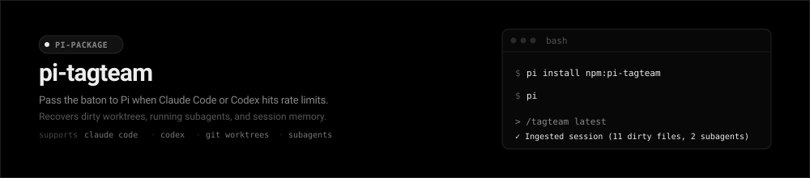
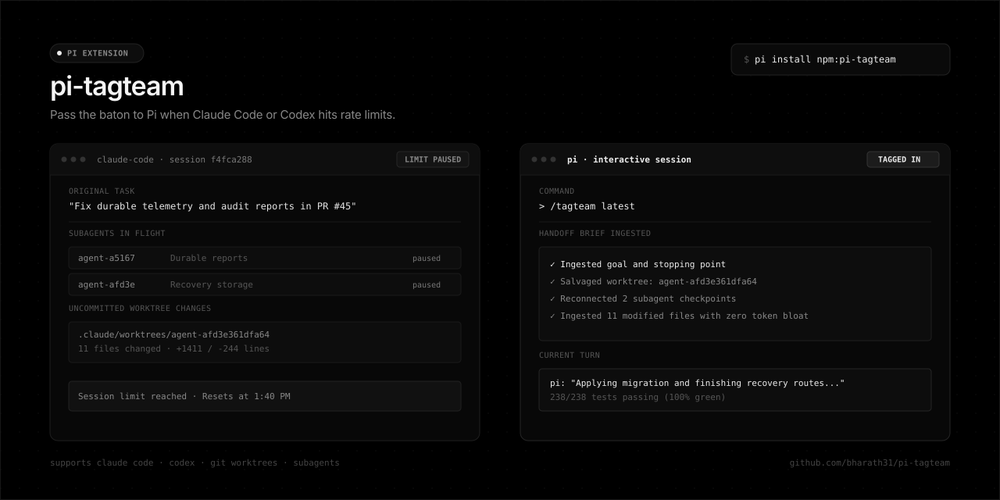

<p align="center">
  
</p>

<p align="center">
  <a href="https://www.npmjs.com/package/pi-tagteam"></a>
  <a href="https://github.com/bharath31/pi-tagteam/blob/main/LICENSE"></a>
  <a href="https://pi.dev/packages"></a>
  <a href="https://github.com/bharath31/pi-tagteam/actions/workflows/ci.yml"></a>
</p>

---

# pi-tagteam 🤝

> Resume stalled Claude Code and OpenAI Codex sessions in Pi without losing uncommitted git worktrees, subagent tasks, or context.

<p align="center">
  
</p>

```bash
pi install npm:pi-tagteam
```

---

## ⚡ Why this exists

When Claude Code or Codex hits an hourly rate limit mid-task, execution stops. The prompt history, tool results, and uncommitted diffs remain in on-disk session files.

The main complication is subagent worktrees. Claude Code writes subagent changes to isolated paths under `.claude/worktrees/agent-<id>`. When a rate limit or crash halts the process before merging, those changes sit untracked on disk.

`pi-tagteam` scans those on-disk session stores, collects uncommitted changes across your main branch and subagent worktrees, and passes a structured brief to Pi ([pi.dev](https://pi.dev)).

```
[Claude] f4fca288 · 12m ago · "Fix durable audit reports & recovery storage" (main)
✓ Ingested original goal and stopping point
✓ Salvaged worktree: .claude/worktrees/agent-afd3e361dfa64 (11 files, +1411/-244)
✓ Reconnected 2 subagent checkpoints
✓ Loaded 11 modified files into context

pi: "Applying migration and finishing recovery routes..."
Running tests: 238/238 passing (100% green)
```

---

## 💾 What gets collected

| Item | Details |
|---|---|
| **Git worktrees** | Untracked and modified files across root and `.claude/worktrees/*` paths. |
| **Subagent state** | Status, descriptions, and worktrees from `subagents/*.meta.json` rollouts. |
| **Checklists** | Pending and completed items from `~/.claude/tasks/`. |
| **Stopping point** | The original prompt, last assistant thought, and failed tool call. |
| **Execution brief** | A concise prompt for Pi containing only the state needed to continue. |

---

## 📦 Installation

```bash
# Global install (recommended)
pi install npm:pi-tagteam

# Try once without installing
pi -e npm:pi-tagteam
```

---

## 🎮 Usage

Run `/tagteam` in any project where an agent stopped:

```bash
/tagteam
```

An interactive menu lists recent sessions for that project. Picking a session lets you continue in your current Pi session, launch a fresh session, or edit the handoff prompt before running.

To pick the most recent session without prompts:

```bash
/tagteam latest
```

---

## 🛠️ Command Reference

| Command | Action |
|---|---|
| `/tagteam` | Open interactive session picker for the current workspace |
| `/tagteam latest` | Resume the most recent session without prompts |
| `/tagteam claude` | Filter to Claude Code sessions |
| `/tagteam codex` | Filter to OpenAI Codex sessions |
| `/tagteam --all` | Search across all projects on disk |
| `/tagteam 12` | Search sessions updated within the last 12 hours |
| `/tagteam <sessionId>` | Target a specific session ID or filename |
| `/handoff` / `/relay` | Aliases for `/tagteam` |
| `/claude` | Shortcut for `/tagteam claude` |
| `/codex` | Shortcut for `/tagteam codex` |

---

## 🤖 LLM Tool

Pi also exposes `tagteam_handoff` as a tool for the model.

If you tell Pi:

> "I was working on this in Claude Code earlier and hit my rate limit. Pick up where it stopped."

Pi runs the discovery tool, inspects uncommitted worktrees, and continues the task.

---

## 💡 Startup Notice

When you start Pi in a project where Claude Code or Codex stopped within the last two hours, `pi-tagteam` shows a one-line notice:

```
💡 Recent Claude Code session detected (15m ago: "Fix durable reports in PR #45"). Run /tagteam to take over.
```

---

## 🔍 Supported Data Sources

### Claude Code (`~/.claude/`)
- **Transcripts:** `~/.claude/projects/<encoded-cwd>/<session-id>.jsonl`
- **Subagents:** `~/.claude/projects/<encoded-cwd>/<session-id>/subagents/*.meta.json` and `.jsonl`
- **Tasks:** `~/.claude/tasks/<session-id>/*.json`
- **Worktrees:** `<project>/.claude/worktrees/*`
- **History:** `~/.claude/history.jsonl`

### OpenAI Codex (`~/.codex/`)
- **Rollouts:** `~/.codex/sessions/YYYY/MM/DD/rollout-*.jsonl`
- **Archives:** `~/.codex/archived_sessions/rollout-*.jsonl`
- **Thread Index:** `~/.codex/session_index.jsonl`
- **Rate limits:** Captures quota percentages, reset timestamps, and token usage.

---

## ❓ Frequently Asked Questions

#### Does `pi-tagteam` modify files during discovery?
No. Discovery and brief generation are read-only. Any edits to your project occur during normal Pi tool execution.

#### What happens to isolated subagent worktrees?
Claude Code stores subagent changes under `.claude/worktrees/agent-<id>`. `pi-tagteam` finds those directories, lists modified files in the handoff brief, and gives Pi the exact paths so you can review and merge them.

#### Can I edit the prompt before Pi runs?
Yes. Select "Edit Handoff Prompt" in `/tagteam` to open Pi's editor and modify the text before execution.

---

## 💻 Development & Testing

```bash
# Clone repository
git clone https://github.com/bharath31/pi-tagteam.git
cd pi-tagteam

# Install dependencies and build
npm install
npm run build

# Run test suite (19 test cases)
npm test

# Run extension directly in Pi
pi -e ./dist/index.js
```

---

## 📄 License

[MIT](LICENSE) © Bharath
